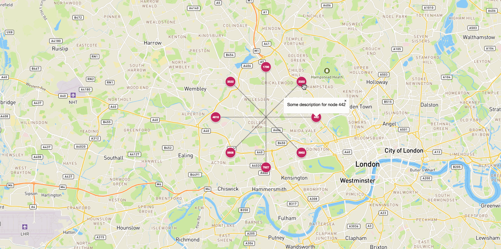

# react-mapboxgl-spiderifier
[](https://github.com/thuanmb/react-mapbox-gl-spiderifier/blob/master/LICENSE)
[](https://www.npmjs.com/package/react-mapbox-gl-spiderifier)

Rendering the spiderifier into `react-mapbox-gl` as `React` component.

Spiral/Circle positioning logic taken from and credits goes to https://github.com/jawj/OverlappingMarkerSpiderfier.

## Examples:
 - https://github.com/thuanmb/react-mapbox-gl-spiderifier/blob/master/src/App.js



## Usage:

#### Simple spiderfication
Please note that the `ReactMapboxGlSpiderifier` should be used together with the `React` wrapper of `mapbox-gl` e.g. `react-mapbox-gl`.
https://github.com/alex3165/react-mapbox-gl

```js
import ReactMapboxGl from 'react-mapbox-gl';
import { ReactMapboxGlSpiderifier } from 'react-mapbox-gl-spiderifier';

const Map = ReactMapboxGl({
  accessToken: '...',
});

const mapProps = {
  style: 'mapbox://styles/mapbox/streets-v8',
};

class App extends Component {
  onStyleLoad = (map) => {
    this.map = map;
  };

  renderPopup(properties, coordinates, offset) {
    if (this.currentPopup) {
      this.currentPopup.remove();
    }

    setTimeout(() => {
      this.currentPopup = new MapboxGl.Popup({ offset })
        .setLngLat(coordinates)
        .setHTML(`Some description for node ${properties.value}`)
        .addTo(this.map);
    });
  }

  renderSpiderifierContent(key, value) {
    return (
      <div className="spiderifier-marker-content" key={key} properties={{ value }}>
        <div>{value}</div>
      </div>
    )
  }

  render() {
    return (
      <div className="App">
        <Map {...mapProps} onStyleLoad={this.onStyleLoad}>
          <ReactMapboxGlSpiderifier
            coordinates={[-0.2268, 51.5361]}
            onClick={(properties, coords, offset) => this.renderPopup(properties, coords, offset)}
           >
            {[100, 200, 300, 400, 500].((n, index) => this.renderSpiderifierContent(index, n))}
          </ReactMapboxGlSpiderifier>
        </Map>
      </div>
    );
  }
}
```

## Doc

#### Properties

- `coordinates ([number, number])`
Display the Spiderifier at the given position

- `circleSpiralSwitchover (number)`
Show spiral instead of circle from this marker count upwards, 0 -> always spiral; Infinity -> always circle

- `circleFootSeparation (number)`
Related to circumference of circle

- `spiralFootSeparation (number)`
Related to size of spiral

- `spiralLengthStart (number)`
Related to size of spiral

- `spiralLengthFactor (number)`
Related to size of spiral

- `animate (bool)`
To enable animate the spiral

- `animationSpeed (number)`
Animation speed in milliseconds

- `transformSpiderLeft (number)`
The margin in left side of each spider

- `transformSpiderTop (number)`
The margin in top of each spider

- `showingLegs (bool)`
Indicate if the legs should be shown even when the spiderifier only have one spider element

#### Events
- `onClick (function)`
The click event handler

- `onMouseDown (function)`
The mouse down event handler

- `onMouseEnter (function)`
The mouse enter event handler

- `onMouseLeave (function)`
The mouse leave event handler

- `onMouseMove (function)`
The mouse move event handler

- `onMouseOut (function)`
The mouse out event handler

- `onMouseOver (function)`
The mouse over event handler

- `onMouseUp (function)`
The mouse up event handler

## ChangeLog:
